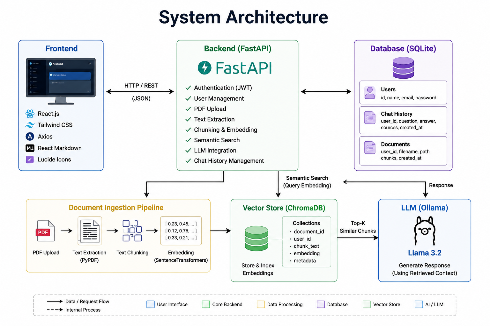
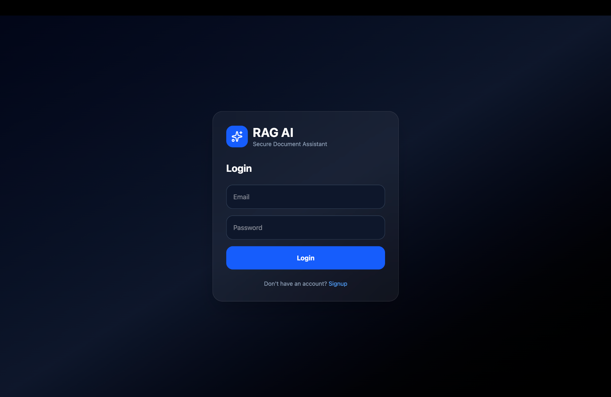
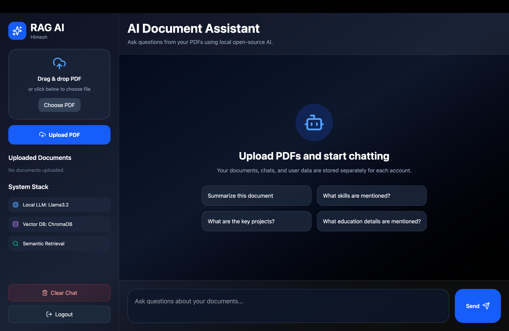
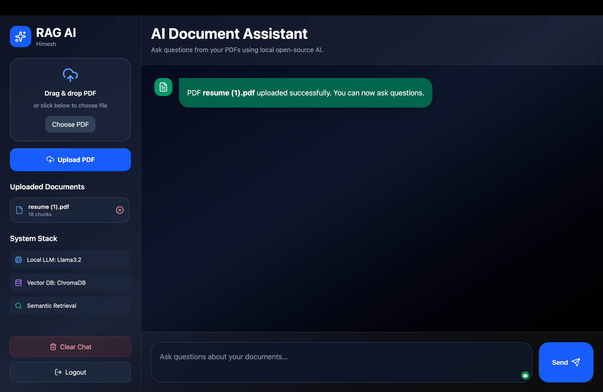
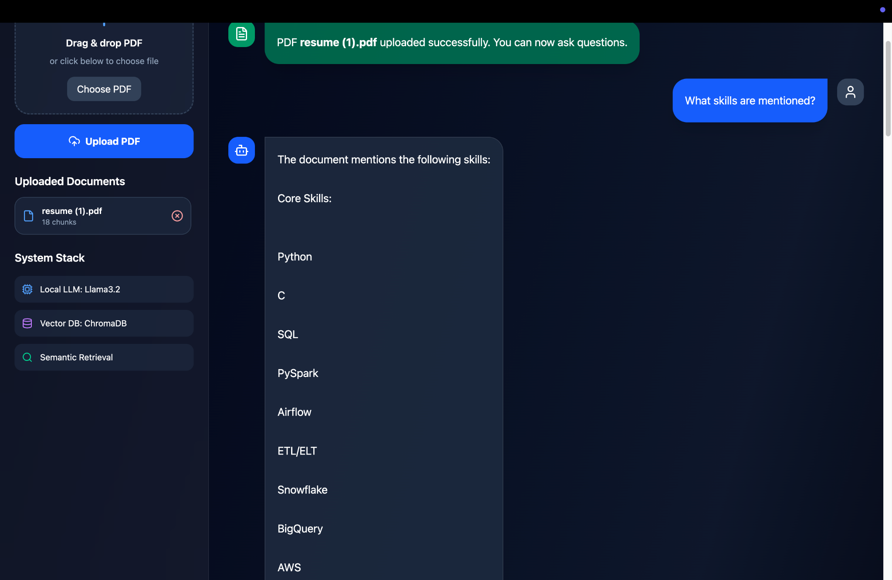

# RAG AI Platform — Intelligent Document Retrieval & AI Assistant

RAG AI Platform is a full-stack AI-powered Retrieval-Augmented Generation (RAG) system designed to allow users to upload PDF documents and interact with them using natural language queries. The platform combines semantic vector search, local LLM inference, secure authentication, and persistent chat history into a scalable AI document assistant.

This project demonstrates the integration of FastAPI microservices, ChromaDB vector databases, local open-source LLMs, React frontend engineering, and semantic retrieval pipelines into a production-style AI application.

---

# 🚀 Project Overview

The platform allows users to:

- Authenticate securely using JWT-based login
- Upload and manage PDF documents
- Ask AI-powered questions from uploaded documents
- Perform semantic document retrieval using embeddings
- Generate contextual responses using local LLMs
- Store chat history persistently
- Maintain user-isolated vector databases
- View source citations for generated answers
- Delete uploaded documents dynamically

The application simulates a scalable AI-powered enterprise document intelligence system.

---

# 🧠 Core AI Pipeline

The system performs:

- PDF text extraction
- Text chunking
- Embedding generation
- Vector indexing
- Semantic similarity retrieval
- LLM-based contextual response generation

The platform uses Retrieval-Augmented Generation (RAG) architecture for accurate and context-aware responses.

---

# 🛠️ Tech Stack

## Frontend

- React.js
- TailwindCSS
- Axios
- React Markdown
- Lucide React Icons

## Backend

- FastAPI
- Python
- SQLAlchemy
- JWT Authentication
- Passlib bcrypt

## Database

- SQLite
- ChromaDB Vector Database

## AI / ML

- SentenceTransformers
- all-MiniLM-L6-v2
- Ollama
- Llama 3.2
- Semantic Similarity Search

---

# ✨ Key Features

- JWT Authentication System
- Secure User-based Document Isolation
- PDF Upload & Processing
- Semantic Vector Search
- Local LLM Integration
- AI Question Answering
- Persistent Chat History
- Multi-document Support
- Source Citation Tracking
- Delete Uploaded Documents
- Modern SaaS-style Dashboard
- Responsive UI Design

---

# 🏗️ System Architecture



---

# 📦 Installation

## Clone Repository

```bash
git clone https://github.com/YOUR_USERNAME/rag-ai-platform.git

cd rag-ai-platform
```

---

# ⚙️ Backend Setup

```bash
cd backend

python3 -m venv venv

source venv/bin/activate

pip install -r requirements.txt

uvicorn main:app --reload
```

Backend runs on:

```bash
http://127.0.0.1:8000
```

API Documentation:

```bash
http://127.0.0.1:8000/docs
```

---

# 🧠 Install Ollama & LLM

Install Ollama:

```bash
https://ollama.com
```

Pull Llama 3.2 model:

```bash
ollama pull llama3.2
```

Run model:

```bash
ollama run llama3.2
```

---

# 💻 Frontend Setup

```bash
cd frontend

npm install

npm run dev
```

Frontend runs on:

```bash
http://localhost:5173
```

---

# 🔍 API Endpoints

| Method | Endpoint          | Description          |
| ------ | ----------------- | -------------------- |
| POST   | `/signup`         | Create new user      |
| POST   | `/login`          | Authenticate user    |
| GET    | `/me`             | Current user details |
| POST   | `/upload`         | Upload PDF           |
| POST   | `/ask`            | Ask AI questions     |
| GET    | `/history`        | Chat history         |
| GET    | `/documents`      | Uploaded documents   |
| DELETE | `/documents/{id}` | Delete document      |

---

# 📸 Application Preview

## 🔐 Authentication System



---

## 🖥️ Main Dashboard



---

## 📄 PDF Upload System



---

## 🤖 AI Question Answering



---

# 📈 System Capabilities

The platform provides:

- Real-time semantic document retrieval
- AI-powered contextual answering
- Persistent vector indexing
- User-isolated embeddings
- Source-based AI responses
- Document lifecycle management
- Local AI inference without cloud dependency

---

# 📁 Project Structure

```text
rag-ai-platform/
│
├── backend/
│   ├── main.py
│   ├── requirements.txt
│   ├── rag_app.db
│   └── uploads/
│
├── frontend/
│   ├── src/
│   ├── package.json
│   └── vite.config.js
│
├── screenshots/
│   ├── login-page.png
│   ├── dashboard.png
│   ├── upload-page.png
│   ├── ai-response.png
│   └── system-architecture.png
│
├── .gitignore
└── README.md
```

---

# 📈 System Workflow

1. User uploads PDF document
2. Backend extracts text from PDF
3. Text is split into semantic chunks
4. Embeddings are generated using SentenceTransformers
5. Embeddings stored inside ChromaDB
6. User asks question
7. Semantic search retrieves relevant chunks
8. Retrieved context sent to local LLM
9. Llama 3.2 generates contextual response
10. Chat history stored in SQLite

---

# 🔮 Future Improvements

- Docker containerization
- PostgreSQL migration
- Redis caching
- Airflow ingestion pipelines
- AWS deployment
- Streaming AI responses
- OCR support for scanned PDFs
- Admin analytics dashboard
- Multi-user collaboration
- Kubernetes deployment

---

# ⚠️ Disclaimer

This platform is intended for:

- Research
- Educational purposes
- AI experimentation
- Semantic retrieval demonstrations

It is NOT intended for sensitive production workloads without additional security hardening.

---

# 👨‍💻 Author

Himesh Engu

Master's in Computer Science  
Northern Arizona University

